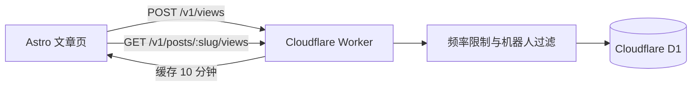

# 访问量统计方案

当前站点使用 Astro 静态输出，文章在构建时生成 HTML，因此不应把访问计数直接写入站点仓库或构建产物。统计应由一个独立、可失败的服务承担：统计服务故障时，文章仍可正常打开。

## 推荐的两层方案

### 第一层：站点分析仪表盘

部署到 Vercel 时启用 **Vercel Web Analytics**；如果部署到 Cloudflare Pages，则启用 **Cloudflare Web Analytics**。这层用于查看全站趋势、来源页、设备和热门页面，不在文章页面展示数字，也不需要改动静态构建方式。

### 第二层：文章页访问量（后续实现）

当需要在文章卡片或文章页显示“阅读量”时，使用 **Cloudflare Worker + D1** 作为轻量计数服务：



Worker 负责校验 `Origin`、过滤常见机器人 UA、按 IP 前缀做短期频率限制，并只保存按天轮换盐值计算出的访客摘要；不要保存原始 IP。D1 只维护文章别名和日期维度的计数，可用原子 UPSERT 增加阅读量。

建议表结构：

```sql
CREATE TABLE post_view_daily (
  slug TEXT NOT NULL,
  viewed_on TEXT NOT NULL,
  views INTEGER NOT NULL DEFAULT 0,
  unique_visitors INTEGER NOT NULL DEFAULT 0,
  PRIMARY KEY (slug, viewed_on)
);
```

## 将来接入步骤

1. 注册 Cloudflare，创建 D1 数据库和 Worker；将正式博客域名加入 Worker 的允许来源。
2. 创建 `POST /v1/views` 与 `GET /v1/posts/:slug/views` 两个端点，并在 Worker 内使用 KV 缓存查询结果。
3. 为 Astro 创建一个最小的 `PostViewTracker` 客户端 island：页面加载后只发送一次 `POST`；请求失败静默忽略。
4. 首次渲染显示“阅读量加载中”或不显示数字；取得数据后再更新，避免让统计服务阻塞首屏。
5. 使用环境变量保存统计服务 URL、公开站点 ID 和管理令牌；管理令牌仅存在 Worker 端，绝不发送到浏览器。
6. 在隐私政策中说明匿名化访问统计；若面向需要同意管理的地区，再接入同意弹窗后才启动 tracker。

## 为什么暂不在当前项目实现

该能力需要选定部署平台、创建数据库与 Worker、配置域名和隐私策略。当前仓库保持 `output: 'static'`，因此先保留这份可执行的接入设计，而不引入未配置的客户端追踪代码或伪造阅读量。
